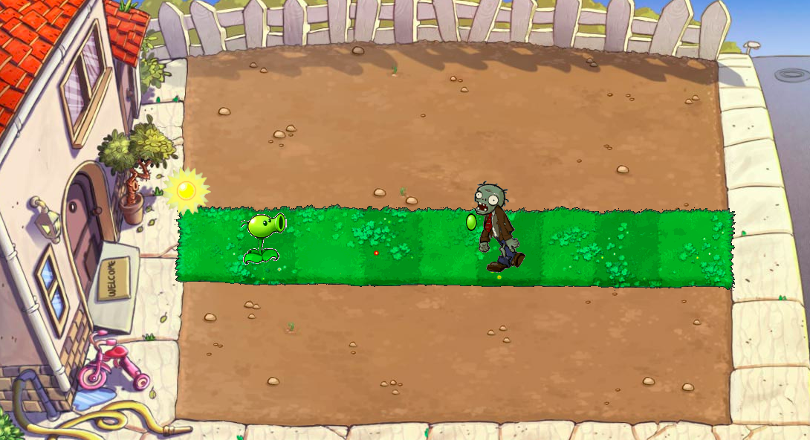

# plants vs zombies
### MVP
### Introduction
This is a simple prototype of action-strategy game Plants vs Zombies. The playing field is a sterile lawn with one horizontal sod lanes. a zombie is able to move horizontally from the right side of the lawn towards the house. The plants are placed on the sod lane and they are stationary. The goal is to grow plants on lawn to protect owner's house and stop a cohort of zombies from reaching it.
### Game Screen Shot

### Gameplay
- Game starts with sun coins of zero and no plants or zombies on the lawn.
- Home owner can increase sun coins through collecting suns dropping on the lawn.
- Suns are falling on the lawn randomly at a set time frame.
- Plants include peashooter and walnut. Peashooter cost 100 sun coins, walnut cost 50 sun coins.
- Each plant has its unique offensive or defensive capability.
- Peashooter is able to launch bullets to shoot zombies and five bullets will kill a zombie.
- User need to click to select the plant in the menu and place the plant on sod lane by clicking.
- Zombies are spawned from the right side of the screen and approaching to the house.
- If zombie is in a critical situation, it will lose the head and continue walking without head.
- If zombie is almost dying, it will fall down on the ground.
- If all zombies are dead, you win the game. If any zombie breaches the house, game is lost.

### Post MVP
- Walnut has a high defensive ability and able to stop the zombies for a period of time.
- Users will enter next level after each success. They can unlock a new plant.

### Specs and Planning
- setInterval to generate suns and zombies.
- addEventListener to the lawn and if click event's target is the sun, add money to the bank.
- select plants on the console menu.
- place the plant on lawn. deduct money from bank.
- setInterval to animate the zombies walking and pod bullet flying.
- each zombie is created with a factory function.
- if collision happens, deduct the according vitality/blood of either plants or zombies.
- when zombie kills all plants and reach the house, the game is over.
- when all zombies are killed, the game is winning.

### Code Snippet
- Instead of storing the object data into the DOM dataset, I write the function to create Peashooter model in Javascript, the function includes the model datasets and the DOM element initialization. It provides the ability to modify my model conveniently and extensibility. I also refactor my model of Zombie and Sun in Javascript.

```
function Peashooter() {
  // peashooter initialization
  this.plant = this.init();
  this.vitality = 3;
  this.shootTime = 3000;
}
// peashooter prototype initialization
Peashooter.prototype.init = function() {
  let peashooter = document.createElement("div");
  peashooter.innerHTML = '';
  return peashooter;
};
```
### Game Link 
[get started to fight zombies](http://righteous-stop.surge.sh/)
### Technologies
- HTML5 & CSS3
- Native Javascript
